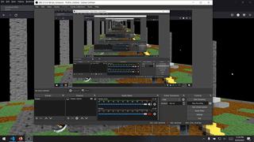

# webmc

Recreation of minecraft in web for creating custom experiences

## Target Features
- Minecraft 'feel' aka artwork and movement
- TS/JS live modding with ES Modules
- Custom music and sounds

## Current Impl
- RigidBody, MeshCollider, SphereCollider, CubeCollider components
- Transform, Mesh, FlatTexMesh components
- Chunks, Texture Atlas generator
- Place / break blocks
- Player raycast hit
- Vec3Animator, item swing and jog animations

# TODO Impl
- Camera, Program (shader) components
- Block sides UVs generation (only gens single quad)
- Finish Transform component methods impl
- Block placement

## Installation
`git clone https://github.com/RepComm/webmc`
`cd ./webmc`
`npm install`

## Building
`npm run build`

Output is in top level directory, source is in /src subdirectory

## Running

Host from an http server such as npm serve
`npm install serve -g`
`serve`

## Or the built in server for hosting games on your LAN over WebSockets
TODO

